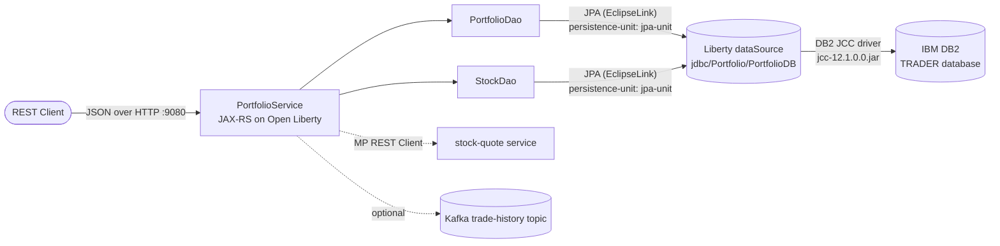
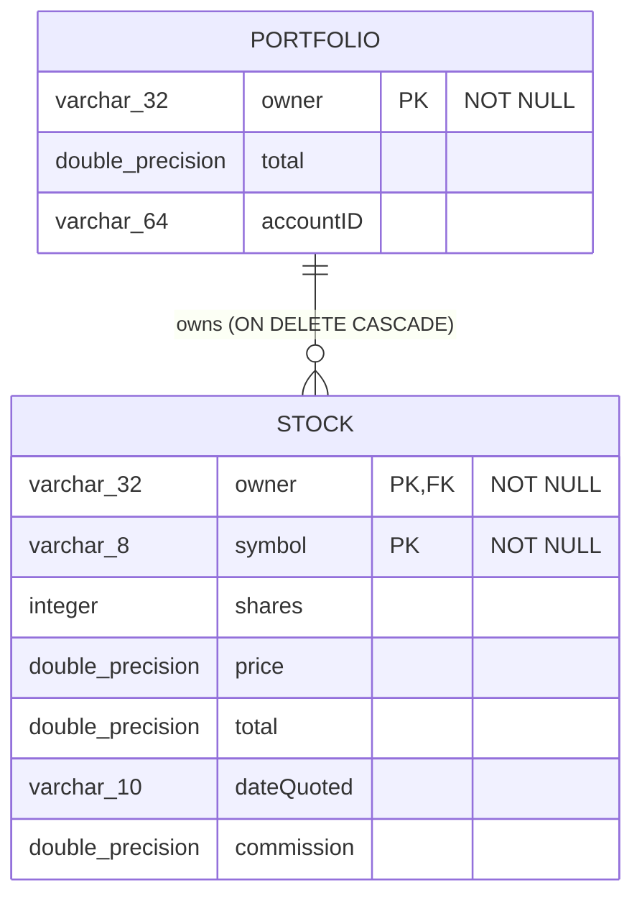

# DB2 Usage Assessment — Portfolio Microservice

This document inventories every touchpoint between the **portfolio** microservice
(IBM Stock Trader) and **IBM DB2**, as input to the migration to **PostgreSQL**.

## 1. Architecture at a Glance

## 2. Schema Inventory (`createTables.ddl`)

Two OLTP tables, loaded via `db2 -tf createTables.ddl`:

| Table | Columns | Keys | Notes |
|---|---|---|---|
| `Portfolio` | `owner VARCHAR(32) NOT NULL`, `total DOUBLE PRECISION`, `accountID VARCHAR(64)` | PK: `owner` | One row per portfolio owner |
| `Stock` | `owner VARCHAR(32) NOT NULL`, `symbol VARCHAR(8) NOT NULL`, `shares INTEGER`, `price DOUBLE PRECISION`, `total DOUBLE PRECISION`, `dateQuoted VARCHAR(10)`, `commission DOUBLE PRECISION` | PK: `(owner, symbol)`; FK: `owner → Portfolio(owner) ON DELETE CASCADE` | One row per holding |

**Type compatibility:** every column type (`VARCHAR`, `INTEGER`, `DOUBLE PRECISION`)
exists in PostgreSQL with identical semantics. No `CLOB`/`BLOB`, no identity columns,
no sequences, no DB2 tablespace/bufferpool clauses. **Schema risk: LOW.**

## 3. Data Access Layer

| Layer | Artifact | DB2-specific? |
|---|---|---|
| JPA entities | `json/Portfolio.java`, `json/Stock.java` | No — standard JPA annotations + JPQL named queries (`Portfolio.findAll`, `Stock.findByOwner`, `Stock.findByOwnerAndSymbol`) |
| DAOs | `dao/PortfolioDao.java`, `dao/StockDao.java` | No — pure `EntityManager` operations (`persist`/`find`/`merge`/`remove`) and named queries; no native SQL |
| Persistence unit | `src/main/resources/META-INF/persistence.xml` | No — JTA datasource lookup by JNDI name `jdbc/Portfolio/PortfolioDB`; EclipseLink provider is database-agnostic |
| Service | `PortfolioService.java` | No — all SQL strings appear only in `logger.fine()` messages describing the equivalent JPA operations |

Because all persistence goes through JPA/JPQL, **no Java code changes are required**.

## 4. DB2-Specific Configuration (the actual migration surface)

| # | Artifact | DB2 coupling |
|---|---|---|
| 1 | `src/main/liberty/config/server.xml` | `JDBC_KIND` variable defaulted to `db2`, which pulls in `includes/db2.xml` |
| 2 | `src/main/liberty/config/includes/db2.xml` | `properties.db2.jcc` datasource: DB2 JCC driver jar (`/config/prereqs/jcc-12.1.0.0.jar`), `securityMechanism="3"` workaround for mainframe crypto |
| 3 | `pom.xml` | `com.ibm.db2:jcc:12.1.0.0` (provided scope, copied into `target/prereqs`) |
| 4 | `Dockerfile` | Copies `target/prereqs` (all JDBC jars incl. DB2 JCC) into `/config/prereqs` |
| 5 | `manifests/*.yaml`, `README.md` | Kubernetes `db2` secret supplying `JDBC_HOST/PORT/DB/ID/PASSWORD` |
| 6 | Isolation level | `TRANSACTION_REPEATABLE_READ` on the datasource — supported natively by PostgreSQL |

The repo already ships a `includes/postgres.xml` datasource definition and the
PostgreSQL JDBC driver in `pom.xml`, so the swap is a configuration change,
not a rewrite.

## 5. DB2-Specific SQL Audit

Grep of `src/main/java` for native SQL: **none found**. All queries are JPQL.
The only SQL-looking strings are trace-log messages. The DDL uses portable
ANSI syntax (`DOUBLE PRECISION`, composite PKs, `ON DELETE CASCADE`).

## 6. Conclusion

| Dimension | Finding |
|---|---|
| Schema | 2 tables, portable ANSI types — direct translation |
| Code | JPA-only, zero native SQL — no changes |
| Config | 4 files (server.xml, datasource include, pom, Dockerfile) |
| Transactions | JTA + REPEATABLE READ — supported by PostgreSQL |
| Overall risk | **LOW** — ideal first-mover candidate for DB2 → PostgreSQL |
