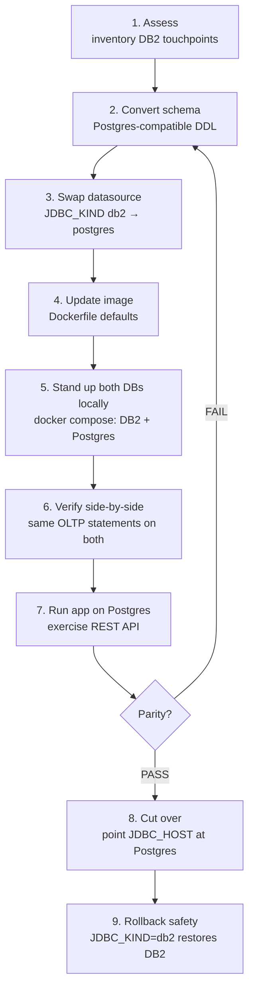

# DB2 → PostgreSQL Migration Plan — Portfolio Microservice

Step-by-step plan to move the portfolio service's OLTP store from IBM DB2 to
PostgreSQL. See [DB2_ASSESSMENT.md](DB2_ASSESSMENT.md) for the full inventory.



## Step 1 — Assess
Inventory schema, DAOs, datasource config, and native SQL
(done — see `docs/DB2_ASSESSMENT.md`). Result: config-only migration.

## Step 2 — Convert the schema
`local/postgres-init/01-createTables.sql` is the PostgreSQL version of
`createTables.ddl`. Types map 1:1 (`DOUBLE PRECISION`, `VARCHAR`, `INTEGER`);
keys and `ON DELETE CASCADE` are unchanged.

## Step 3 — Swap the Liberty datasource
* `server.xml`: `JDBC_KIND` default changed `db2` → `postgres`, selecting
  `includes/postgres.xml` (PGConnectionPoolDataSource) instead of
  `includes/db2.xml` (DB2 JCC).
* `includes/postgres.xml`: `sslMode` is now driven by the `JDBC_SSLMODE`
  variable (default `disable` for local; set `verify-ca` in production).
* Connection details keep flowing through the same env vars
  (`JDBC_HOST`, `JDBC_PORT`, `JDBC_DB`, `JDBC_ID`, `JDBC_PASSWORD`), so
  Kubernetes secrets only need new values, not new keys.

## Step 4 — Update the container image
`Dockerfile` sets `ENV JDBC_KIND=postgres`. The PostgreSQL driver
(`postgresql-42.7.7.jar`) was already copied into `/config/prereqs` by the
Maven `copy-dependencies` step.

## Step 5 — Stand up both databases locally
```bash
docker compose -f local/docker-compose.yml up -d
```
Brings up `stocktrader-db2` (icr.io/db2_community/db2, TRADER database,
schema auto-loaded via `/var/custom` init hook — allow several minutes) and
`stocktrader-postgres` (postgres:16, schema auto-loaded from
`docker-entrypoint-initdb.d`).

## Step 6 — Verify side-by-side
```bash
python3 local/verify_migration.py
```
Runs the same representative OLTP statements (INSERT / SELECT / UPDATE /
aggregate / cascade DELETE) against **both** databases, compares results, and
prints a PASS/FAIL table plus an HTML parity report
(`docs/migration-report.html`).

## Step 7 — Run the app against PostgreSQL
```bash
JAVA_HOME=<jdk17> mvn package
docker build -t portfolio .
docker run -d --name portfolio --network local_default -p 9080:9080 \
  -e AUTH_TYPE=none -e KAFKA_ADDRESS=kafka:9092 \
  -e JDBC_HOST=postgres -e JDBC_PORT=5432 -e JDBC_DB=trader \
  -e JDBC_ID=db2inst1 -e JDBC_PASSWORD=StockTrader123 portfolio
# Exercise the OLTP API:
curl -u stock:trader -X POST http://localhost:9080/portfolio/John
curl -u stock:trader -X PUT  "http://localhost:9080/portfolio/John?symbol=IBM&shares=123"
curl -u stock:trader http://localhost:9080/portfolio/John
curl -u stock:trader -X DELETE http://localhost:9080/portfolio/John
```

## Step 8 — Cut over
Point the `db2` Kubernetes secret's `host/port/db/id/pwd` values at the
PostgreSQL instance (managed Postgres recommended) and roll the deployment.

## Step 9 — Rollback safety
DB2 config is retained (`includes/db2.xml`, JCC jar). Setting
`JDBC_KIND=db2` on the container restores the original behavior instantly.
