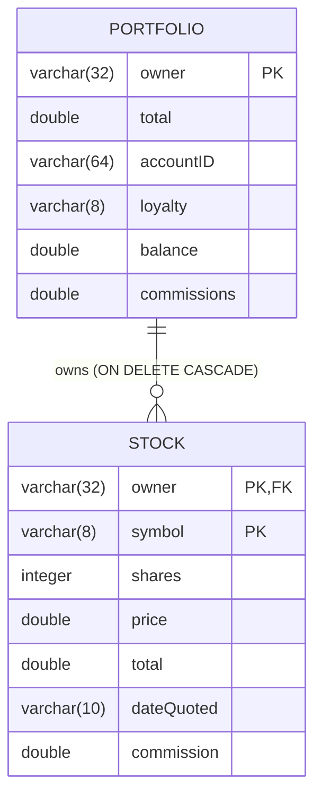

# DB2 Footprint Assessment — `portfolio` microservice

**Phase 1 of the DB2 → PostgreSQL migration.** This document inventories everything in this
repository that touches IBM DB2: the schema, the stored procedures (and the business logic
inside them), and every place the Java code talks to the database.

---

## 1. Schema Inventory (`createTables.ddl`)

Two tables, created with `db2 -tf createTables.ddl`:

### 1.1 `Portfolio`

| Column        | DB2 Type           | Nullable | Notes                                  |
|---------------|--------------------|----------|----------------------------------------|
| `owner`       | `VARCHAR(32)`      | NOT NULL | **Primary key**                        |
| `total`       | `DOUBLE PRECISION` | yes      | Current market value of all holdings   |
| `accountID`   | `VARCHAR(64)`      | yes      | Link to the Account microservice       |
| `loyalty`     | `VARCHAR(8)`       | yes      | Tier: Basic/Bronze/Silver/Gold/Platinum|
| `balance`     | `DOUBLE PRECISION` | yes      | Cash balance (starts at 50.0)          |
| `commissions` | `DOUBLE PRECISION` | yes      | Cumulative commissions paid            |

### 1.2 `Stock`

| Column       | DB2 Type           | Nullable | Notes                                    |
|--------------|--------------------|----------|-------------------------------------------|
| `owner`      | `VARCHAR(32)`      | NOT NULL | Composite PK, **FK → Portfolio(owner)** with `ON DELETE CASCADE` |
| `symbol`     | `VARCHAR(8)`       | NOT NULL | Composite PK                              |
| `shares`     | `INTEGER`          | yes      | Signed: buys add, sells subtract          |
| `price`      | `DOUBLE PRECISION` | yes      | Last quoted price                         |
| `total`      | `DOUBLE PRECISION` | yes      | `shares * price`                          |
| `dateQuoted` | `VARCHAR(10)`      | yes      | `yyyy-MM-dd` string (mapped to JPA column `dateQuoted`) |
| `commission` | `DOUBLE PRECISION` | yes      | Cumulative commission for this position   |

### 1.3 ER Diagram

---

## 2. Stored Procedures (`stored-procs.ddl`)

Two DB2 SQL PL procedures, created with `db2 -td@ -f stored-procs.ddl`. **These contain real
business logic** — the loyalty tiering and commission schedule live in the database today.

### 2.1 `UPDATE_LOYALTY_LEVEL(IN owner, IN total, OUT loyalty)`

Business rules (tiered loyalty levels):

| Portfolio total          | Loyalty tier |
|--------------------------|--------------|
| ≥ 1,000,000              | `Platinum`   |
| ≥ 100,000                | `Gold`       |
| ≥ 50,000                 | `Silver`     |
| ≥ 10,000                 | `Bronze`     |
| otherwise                | `Basic`      |

Side effect: `UPDATE Portfolio SET loyalty = <tier> WHERE owner = ?`, then returns the tier.

### 2.2 `CALCULATE_COMMISSION(IN owner, IN tradeValue, OUT commission)`

Business rules (loyalty-based commission schedule):

| Loyalty tier (read from `Portfolio.loyalty`, `COALESCE(loyalty,'Basic')`) | Base commission |
|-----------|---------|
| Platinum  | 5.99    |
| Gold      | 6.99    |
| Silver    | 7.99    |
| Bronze    | 8.99    |
| Basic     | 9.99    |

Plus a **large-block-trade surcharge**: if `tradeValue > 250,000`, add `tradeValue * 0.00005`
(half a basis point) to the commission.

Side effects:
`UPDATE Portfolio SET commissions = COALESCE(commissions,0) + c, balance = COALESCE(balance,0) - c WHERE owner = ?`,
then returns the commission.

> **Key ordering subtlety:** the commission is computed from the loyalty tier *as stored before
> the trade* (the loyalty refresh happens afterwards, in `getPortfolio`). Any lifted
> implementation must preserve this read-before-update ordering to stay bit-for-bit compatible.

---

## 3. Java Code Touchpoints

| File | DB interaction |
|------|----------------|
| `PortfolioService.java` | JNDI lookup of `jdbc/Portfolio/PortfolioDB`; `CallableStatement` calls `CALL UPDATE_LOYALTY_LEVEL(?,?,?)` (in `invokeUpdateLoyaltyLevel`, used by `getPortfolio`) and `CALL CALCULATE_COMMISSION(?,?,?)` (in `invokeCalculateCommission`, used by `updatePortfolio`/PUT). **Only DB2-specific call sites in the codebase.** |
| `dao/PortfolioDao.java` | Pure JPA (EclipseLink) — `persist`/`find`/`merge`/`remove` + named query `Portfolio.findAll`. Database-agnostic. |
| `dao/StockDao.java` | Pure JPA — named queries `Stock.findByOwner`, `Stock.findByOwnerAndSymbol`. Database-agnostic. |
| `json/Portfolio.java`, `json/Stock.java` | JPA entities; `Stock` maps `dateQuoted` via `@Column(name="dateQuoted")`. No DB2-specific annotations. |
| `src/main/resources/META-INF/persistence.xml` | JTA datasource `jdbc/Portfolio/PortfolioDB`; EclipseLink; no DB2-specific properties. |
| `src/main/liberty/config/server.xml` | Selects datasource include via `${JDBC_KIND}` (default **`db2`**). |
| `src/main/liberty/config/includes/db2.xml` | DB2 JCC driver (`jcc-12.1.0.0.jar`), `properties.db2.jcc`, `securityMechanism="3"`. |
| `src/main/liberty/config/includes/postgres.xml` | PostgreSQL driver stanza already scaffolded (`postgresql-42.7.7.jar`) but hard-wired to `sslMode="verify-ca"`, which fails against a plain local Postgres. |
| `pom.xml` | Ships **both** `com.ibm.db2:jcc` and `org.postgresql:postgresql` into `target/prereqs` (copied to `/config/prereqs` in the image). |
| `manifests/*.yaml`, `chart/` | `JDBC_*` env vars come from the `db2` Kubernetes secret; `JDBC_KIND` selects the backend. |

## 4. Risk Summary

1. **Stored procedures are the only hard DB2 dependency.** JPA/DDL are otherwise portable.
2. **Double-precision money arithmetic** — both DB2 `DOUBLE` and Postgres `DOUBLE PRECISION`
   are IEEE-754 binary64, so lifted Java `double` math reproduces results exactly.
3. **Commission-before-loyalty ordering** (see §2.2) must be preserved in the lifted code.
4. **`COALESCE(...,0)` null handling** in the procs must be replicated for portfolios with
   NULL `balance`/`commissions`.
5. **Case-insensitive identifiers**: DB2 folds unquoted identifiers to upper case, Postgres to
   lower case; the DDL and all generated JPA SQL use unquoted identifiers, so both fold
   consistently within each database. No quoting changes needed.
